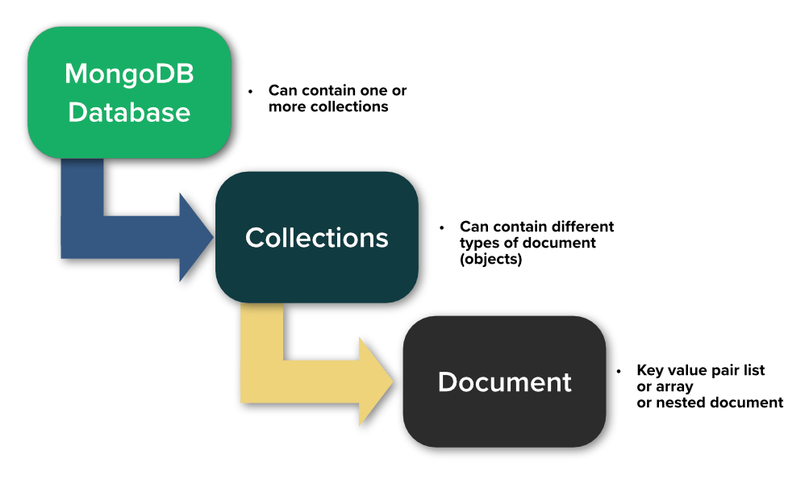

# Databases and MongoDB
these are a bullet points of our session

## some history about data and databases
- we need to store things
- 70th --> ibm 
- late 70th --> oracle
- how much data in the world --> 79 zetabyte
- ok can we use only a files?
- what is a database --> IMDB
- what is a data
- what and why is dbms? --> business and technical reasons

## databases types?
- a lot of database types
- SQL vs NoSQL
- NoSQL --> document, relational, graph, key-value, columnar, timestamp
- [database engines](https://db-engines.com/en/ranking)

## what is mongoDB?

MongoDB is an [open source](https://github.com/mongodb/mongo) NoSQL database management program. NoSQL (Not only SQL) is used as an alternative to traditional relational databases. NoSQL databases are quite useful for working with large sets of distributed data. MongoDB is a tool that can manage document-oriented information, store or retrieve information.

## Advantages of MongoDB:

- Schema Flexibility
- Scalability
- High Performance
- Rich Query Language
- Flexible Deployment Options

## Why MongoDB is commonly used with Node.js?

- JSON Compatibility
- Asynchronous Nature
- Developer Productivity
- Community Support and Ecosystem
- Microservices Architecture

## mongo architecture
 

- the name root: humongous
- documents = objects = group of fields(like json - [bson](https://www.mongodb.com/basics/bson))
- every document has a unique id
- collections
- database
- a little bit oop principles

## install mongodb
- locally
- use atlas

## connect using
- cli --> mongosh
    - show dbs
    - use <database> --> create or use
    - db.createCollection("collection_name")
    - db.dropDatabase()

- mongoDB compass --> desktop app

## connect to mongo using node
- node -v --> get node version
- npm install mongodb --> installing
- npm list mongodb --> check mongo version

## CRUD operations
- [documentation](https://www.mongodb.com/docs/manual/crud/)
- you can find code examples [here](./CRUD-examples/)
- create database
    - use <db>
    - createCollection(<collection_name>)

- create --> insert
    - db.collection.insertOne(<document>) 
    - db.collection.insertMany(<list of documents>)

- read --> get
    - db.collection_name.find(query, projection)
    - db.collection_name.findOne(query, projection)

- update
    - db.collection.updateOne()
    - db.collection.updateMany()
    - db.collection.replaceOne()

- delete
    - db.collection.deleteOne()
    - db.collection.deleteMany()

## data types
- string
- integers
- double
- boolean
- Date --> new Date()
- null
- array --> []
- nested documents

## schema design
- no rules --> design a schema based on the unique needs of your application
- all in one place (reduce joins)
- relations types
    - one to one --> name
    - one to many --> parts of car
    - one to squillions --> logs
    - many to many --> todo tasks, users

## Mongoose
- ODM --> object data modeling
- you can do anything with mongoose by mongodb driver, mongoose just abstract the operations
- first create a schema (mongoose schema map to a collection)
- schema is just fields and types
- a model = take the schema and apply it to each document in the collection
- model is responsible for CRUD operations
- const m = mongoose.model
('collection_name', schema)

## Restful API

## Authentication and Authorization

## More resources
- [what is mongodb](https://youtu.be/RGfFpQF0NpE?si=z2sySCRUnTRbhi9C)
- [mongodb compass and shell](https://youtu.be/c2M-rlkkT5o?si=9oePq1GGUjR4ek7B)
- [another mongodb connector and node.js](https://youtu.be/fbYExfeFsI0?si=vo-61B9Yuot30o-V)
- [mongoose](https://youtu.be/bALyYC10ABw?si=cTRmifrQGUUS2frH)
